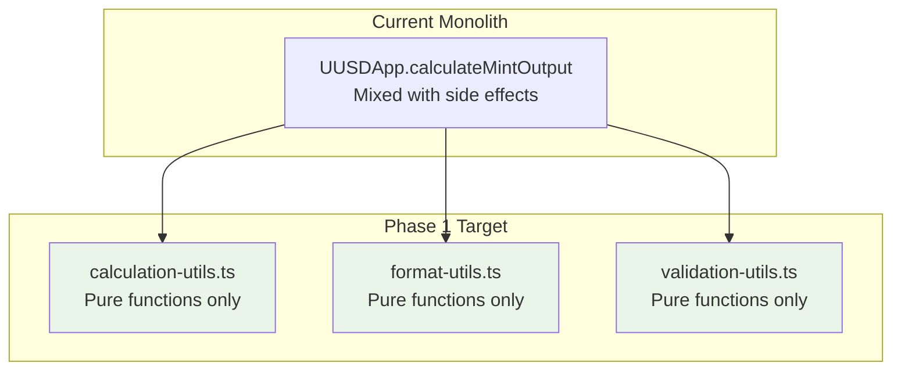
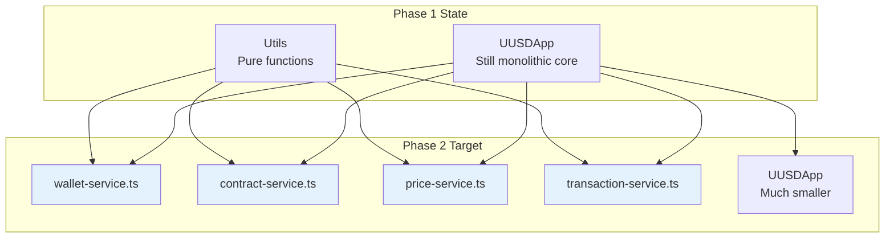
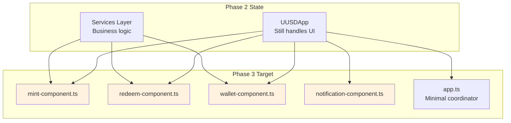

# Active Context: UUSD Refactoring Focus

## Current Work Focus

### Primary Objective: Modular Architecture Migration

The immediate focus is transforming the monolithic 807-line `UUSDApp` class into a clean, maintainable modular architecture. This refactoring prioritizes **separation of concerns** and **technical architecture** improvements while preserving all existing functionality.

### Current State Analysis

#### Monolithic Pain Points Identified
1. **Single Responsibility Violation**: One class handles wallet management, contract interactions, UI logic, price calculations, and state management
2. **Tight Coupling**: Business logic directly manipulates DOM elements, making testing and reuse impossible
3. **Hidden Dependencies**: Services are instantiated within methods rather than injected, making dependency relationships unclear
4. **Mixed Abstraction Levels**: High-level user workflows mixed with low-level blockchain operations
5. **State Management Chaos**: Application state scattered across private methods and DOM elements

#### Key Architectural Insights from Code Analysis

**Complex Business Logic Patterns**:
- Dynamic collateral ratio calculations with three distinct modes (100% collateral, mixed mode, governance-only)
- Multi-step transaction flows requiring approval management and state tracking
- Real-time price calculations responding to user input changes
- Error handling across multiple layers (UI, business logic, blockchain)

**Critical Preservation Requirements**:
- Exact mathematical calculations for mint/redeem operations must be preserved
- Multi-step approval workflows (collateral → governance → transaction) must work identically
- Real-time UI updates based on blockchain state must continue working
- Error handling and user feedback patterns must be maintained

## Refactoring Strategy

### Phase 1: Extract Pure Functions (Week 1)
**Goal**: Create isolated, testable utility functions



**Extraction Targets**:
- `calculateMintOutput()` → `calculation-utils.ts`
- `calculateRedeemOutput()` → `calculation-utils.ts`
- `formatAddress()`, `formatAmount()` → `format-utils.ts`
- Input validation logic → `validation-utils.ts`

**Success Criteria**:
- All utility functions are pure (no side effects)
- 100% unit test coverage for calculations
- Original UUSDApp still functional using extracted utilities

### Phase 2: Extract Services Layer (Week 2)
**Goal**: Separate business logic from UI logic



**Service Extraction Priority**:
1. **WalletService**: Cleanest extraction, minimal dependencies
2. **ContractService**: Well-defined blockchain interaction boundaries
3. **PriceService**: Pure business logic depending on ContractService
4. **TransactionService**: Complex orchestration, depends on other services

**Success Criteria**:
- Each service has clear, single responsibility
- Services communicate through well-defined interfaces
- All services are unit testable with mocked dependencies
- Original functionality preserved

### Phase 3: Extract UI Components (Week 3)
**Goal**: Create reusable, testable UI components



**Component Extraction Strategy**:
- Components handle only UI state and user interactions
- Business logic delegated to injected services
- Each component testable with mocked services
- Clear event-driven communication patterns

## Current Decision Points

### 1. Dependency Injection Strategy

**Options Considered**:
- **Manual Constructor Injection**: Simple, explicit dependencies
- **DI Container**: More complex but enables advanced features
- **Function-based DI**: Lightweight alternative

**Current Decision**: Start with manual constructor injection for simplicity, evolve to container if needed

**Rationale**:
- Fewer dependencies to introduce initially
- Clear, explicit dependency relationships
- Easy to understand and debug
- Can refactor to container later without breaking changes

### 2. Error Handling Architecture

**Current Pattern Analysis**:
```typescript
// Current monolithic error handling
try {
    // blockchain operation
} catch (error: any) {
    this.showError('mint', error.message); // Direct DOM manipulation
}
```

**Target Pattern**:
```typescript
// Layered error handling
class ContractService {
    async mint(): Promise<Result<TransactionHash, ContractError>> {
        try {
            return Ok(await this.contract.mintDollar(...));
        } catch (error) {
            return Err(new ContractError('Mint failed', error));
        }
    }
}

class MintComponent {
    async handleMint(): Promise<void> {
        const result = await this.contractService.mint();
        if (result.isErr()) {
            this.notificationService.showError(result.error.userMessage);
        }
    }
}
```

**Decision**: Implement Result<T, E> pattern for explicit error handling

### 3. State Management Approach

**Current Issues**: State scattered across DOM elements and private variables

**Options**:
- **Service-based State**: Each service manages its own state
- **Centralized Store**: Redux-like state management
- **Event-driven State**: Services emit events, components listen

**Current Decision**: Service-based state with event emissions

**Implementation**:
```typescript
class WalletService {
    private state: WalletState = { isConnected: false, account: null };
    private listeners: ((state: WalletState) => void)[] = [];

    onStateChange(callback: (state: WalletState) => void): void {
        this.listeners.push(callback);
    }

    private notifyStateChange(): void {
        this.listeners.forEach(callback => callback(this.state));
    }
}
```

## Next Steps (Immediate Priorities)

### This Week: Phase 1 Preparation
1. **Create Type Definitions** (`types/` folder)
   - Define all interfaces for services and data structures
   - Create comprehensive TypeScript types for current functionality

2. **Set Up Testing Infrastructure**
   - Configure Bun test runner
   - Create testing utilities and mocks
   - Establish testing patterns for pure functions

3. **Extract First Utility Module**
   - Start with `calculation-utils.ts` (lowest risk)
   - Implement comprehensive unit tests
   - Verify original app still works with extracted utilities

### Next Week: Phase 1 Completion
1. **Complete Utils Extraction**
   - `format-utils.ts` with display formatting functions
   - `validation-utils.ts` with input validation logic

2. **Create Service Interfaces**
   - Define all service contracts in `types/` folder
   - Establish dependency relationships between services

3. **Begin WalletService Extraction**
   - Simplest service with clearest boundaries
   - Template for subsequent service extractions

## Risk Management

### Technical Risks

**Risk**: Breaking existing functionality during refactoring
**Mitigation**:
- Incremental extraction with continuous testing
- Maintain original app.ts until all modules extracted
- Comprehensive regression testing at each phase

**Risk**: Complex blockchain interactions broken during service extraction
**Mitigation**:
- Extract contract interactions last (most complex)
- Create comprehensive mocks for testing
- Test against actual contracts in development environment

### Timeline Risks

**Risk**: Refactoring takes longer than expected
**Mitigation**:
- Start with lowest-risk extractions (utils, then simple services)
- Each phase delivers working application
- Can pause refactoring at any phase if needed

**Risk**: New bugs introduced during refactoring
**Mitigation**:
- Comprehensive unit test coverage before extraction
- End-to-end testing of critical user workflows
- Side-by-side comparison of old vs new implementations

## Success Metrics

### Phase 1 Success (Pure Functions)
- [ ] All calculation logic extracted to pure functions
- [ ] 100% unit test coverage for calculations
- [ ] Original app functionality preserved
- [ ] Build time remains under 5 seconds

### Phase 2 Success (Services)
- [ ] All business logic moved to services
- [ ] Services testable in isolation with mocks
- [ ] Clear dependency relationships established
- [ ] No DOM manipulation in services

### Phase 3 Success (Components)
- [ ] UI logic separated from business logic
- [ ] Components testable with service mocks
- [ ] Clear event-driven communication
- [ ] app.ts under 100 lines (coordination only)

### Overall Success
- [ ] All existing functionality preserved
- [ ] Codebase more maintainable (avg file <200 lines)
- [ ] New features can be added without modifying existing modules
- [ ] Comprehensive test coverage enables confident changes