# Product Context: UUSD DeFi Platform

## Why UUSD Exists

### The Stablecoin Problem
Traditional centralized stablecoins (USDC, USDT) require trust in central authorities and can be subject to censorship, freezing, or depegging during market stress. DeFi needs truly decentralized stablecoin solutions that maintain stability through algorithmic mechanisms rather than centralized control.

### UUSD Solution
UUSD (Ubiquity Dollar) solves this by creating a decentralized stablecoin backed by:
- **Multiple Collateral Types**: Diversified backing reduces single-point-of-failure risk
- **Governance Token Integration**: UBQ tokens provide additional stability mechanisms
- **Dynamic Collateral Ratios**: System adapts to market conditions automatically
- **Transparent Smart Contracts**: All operations are verifiable on-chain

## Core User Problems Solved

### For DeFi Users
- **Capital Efficiency**: Mint stablecoins against existing crypto holdings without selling
- **Decentralized Stability**: Access to stable value without centralized counterparty risk
- **Multi-Collateral Flexibility**: Choose from various acceptable collateral types
- **Redemption Guarantees**: Always able to redeem UUSD for underlying collateral

### For Liquidity Providers
- **Earning Opportunities**: Fees from minting and redemption operations
- **Governance Participation**: UBQ token holders influence protocol parameters
- **Risk Management**: Dynamic ratios protect against market volatility

## How UUSD Works

### Core User Workflows

```mermaid
flowchart TD
    subgraph "Minting Workflow"
        A[Connect Wallet] --> B[Select Collateral Type]
        B --> C[Enter UUSD Amount]
        C --> D[View Required Inputs]
        D --> E{Approve Tokens?}
        E -->|No| F[Approve Collateral]
        E -->|No| G[Approve UBQ]
        F --> H[Execute Mint]
        G --> H
        E -->|Yes| H
        H --> I[Receive UUSD]
    end

    subgraph "Redemption Workflow"
        J[Connect Wallet] --> K[Select Collateral Type]
        K --> L[Enter UUSD Amount]
        L --> M[View Redemption Output]
        M --> N{Approve UUSD?}
        N -->|No| O[Approve UUSD]
        O --> P[Execute Redeem]
        N -->|Yes| P
        P --> Q[Wait for Processing]
        Q --> R[Collect Assets]
    end
```



### Collateral Ratio Mechanics

**Dynamic Collateral Requirements**:
- **100% Collateral Mode**: Only collateral required (higher cost)
- **Mixed Mode**: Combination of collateral + UBQ governance tokens
- **Governance Mode**: Primarily UBQ tokens (when available)

**Price Calculation Logic**:
```
if (collateralRatio >= 100%) {
    // Collateral-only mode
    collateralNeeded = dollarAmount / collateralPrice
    governanceNeeded = 0
} else if (collateralRatio === 0%) {
    // Governance-only mode
    collateralNeeded = 0
    governanceNeeded = dollarAmount / governancePrice
} else {
    // Mixed mode
    collateralPortion = dollarAmount * collateralRatio
    governancePortion = dollarAmount * (1 - collateralRatio)
    collateralNeeded = collateralPortion / collateralPrice
    governanceNeeded = governancePortion / governancePrice
}
```

### Fee Structure
- **Minting Fee**: Applied when creating new UUSD tokens
- **Redemption Fee**: Applied when burning UUSD for collateral
- **Variable Rates**: Fees adjust based on market conditions and collateral type

## User Experience Goals

### Simplicity
- **One-Click Operations**: Minimal steps from intent to execution
- **Clear Feedback**: Always show exactly what user will pay/receive
- **Progressive Disclosure**: Advanced options available but not required

### Transparency
- **Real-Time Calculations**: Immediate feedback on mint/redeem amounts
- **Fee Visibility**: All costs clearly displayed before transactions
- **Transaction Status**: Clear progress indication for multi-step operations

### Safety
- **Slippage Protection**: Minimum output amounts prevent sandwich attacks
- **Approval Management**: Granular control over token approvals
- **Error Prevention**: Validation prevents impossible transactions

### Performance
- **Fast Calculations**: Sub-second response to user input changes
- **Optimized Transactions**: Minimal gas costs through efficient contract calls
- **Responsive Design**: Works across desktop and mobile devices

## Target User Personas

### DeFi Power Users
- **Needs**: Maximum capital efficiency, advanced features, detailed analytics
- **Behaviors**: Frequently adjusts positions, monitors multiple protocols
- **Pain Points**: Gas costs, complex UIs, slippage on large trades

### Casual Crypto Users
- **Needs**: Simple stablecoin access, clear explanations, safety
- **Behaviors**: Occasional large transactions, prefers guided experiences
- **Pain Points**: Complexity, fear of making mistakes, unclear fees

### Institutional Users
- **Needs**: Large transaction capacity, predictable costs, compliance features
- **Behaviors**: Planned operations, risk management focus
- **Pain Points**: Liquidity limits, regulatory uncertainty, operational overhead

## Success Metrics

### User Adoption
- **Daily Active Users**: Consistent growth in wallet connections
- **Transaction Volume**: Increasing mint/redeem activity
- **Retention Rate**: Users returning within 30 days

### Protocol Health
- **Total Value Locked**: Growth in collateral backing UUSD
- **Redemption Rate**: Healthy balance of mints vs redeems
- **Fee Revenue**: Sustainable income for protocol development

### User Satisfaction
- **Transaction Success Rate**: >95% completion rate
- **Average Transaction Time**: <2 minutes from start to finish
- **Support Ticket Volume**: Decreasing questions about basic operations