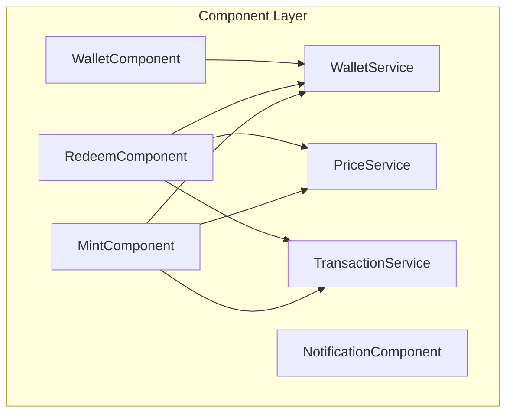
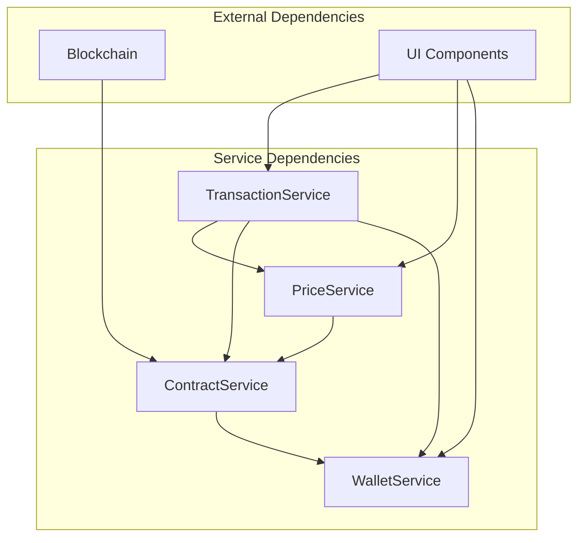
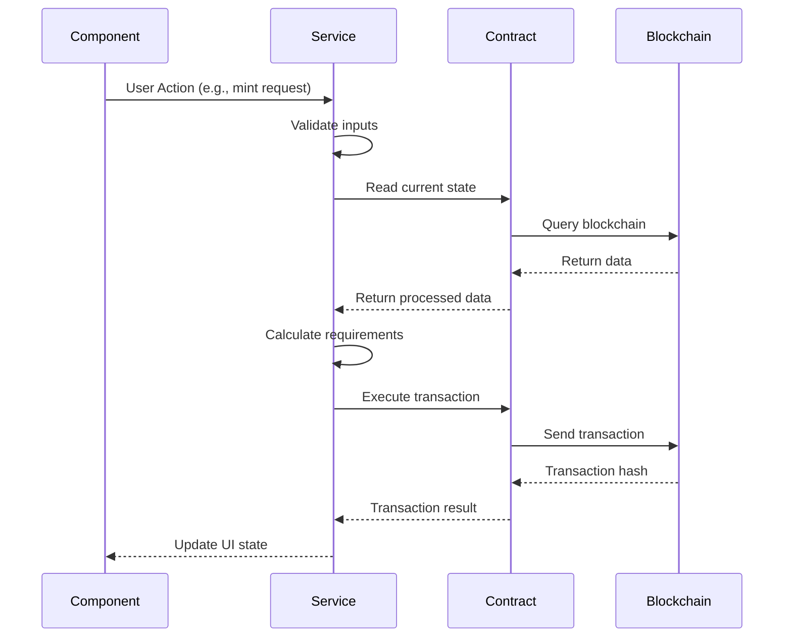
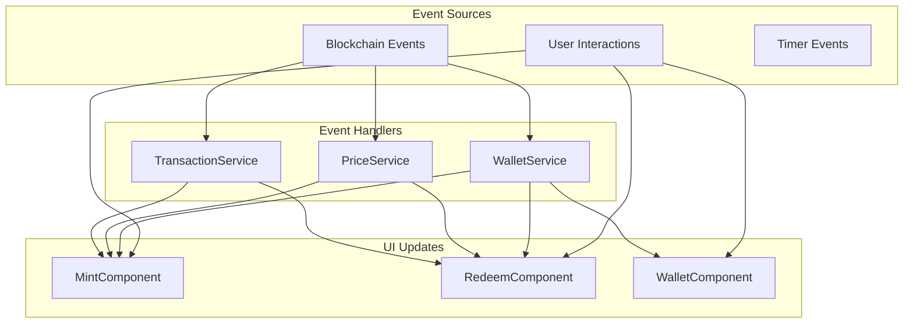

# System Patterns: UUSD Modular Architecture

## Overview

This document defines the target modular architecture for the UUSD application, replacing the current 807-line monolithic `UUSDApp` class with a clean separation of concerns across distinct layers.

## Current vs Target Architecture

### Current Monolithic Structure
```
app.ts (807 lines)
├── Wallet management
├── Contract interactions
├── Price calculations
├── UI event handling
├── State management
├── Error handling
└── Transaction flows
```

### Target Modular Architecture
```
src/
├── components/          # UI Logic Layer
│   ├── mint-component.ts
│   ├── redeem-component.ts
│   ├── wallet-component.ts
│   └── notification-component.ts
├── services/            # Business Logic Layer
│   ├── wallet-service.ts
│   ├── contract-service.ts
│   ├── price-service.ts
│   └── transaction-service.ts
├── contracts/           # Blockchain Layer
│   ├── abis.ts
│   ├── addresses.ts
│   └── client-factory.ts
├── utils/              # Pure Functions Layer
│   ├── calculation-utils.ts
│   ├── format-utils.ts
│   └── validation-utils.ts
├── types/              # Type Definitions
│   ├── wallet.types.ts
│   ├── contract.types.ts
│   └── ui.types.ts
└── app.ts              # Application Entry Point
```

## Layer Responsibilities

### 1. Components Layer (UI Logic)

**Purpose**: Handle user interactions and UI state management without business logic.



**Key Patterns**:
- **Event-Driven**: Components respond to user events and service updates
- **Stateless**: UI state derived from service state, not stored locally
- **Dependency Injection**: Services injected into components via constructor
- **Interface Segregation**: Components only depend on service interfaces they use

#### MintComponent
```typescript
interface MintComponentDeps {
    walletService: IWalletService;
    priceService: IPriceService;
    transactionService: ITransactionService;
}

class MintComponent {
    constructor(private deps: MintComponentDeps) {}

    // UI event handlers only - no business logic
    async handleAmountChange(amount: string): Promise<void>
    async handleCollateralChange(collateralIndex: number): Promise<void>
    async handleSubmit(): Promise<void>
}
```

### 2. Services Layer (Business Logic)

**Purpose**: Implement core business logic and coordinate between components and contracts.



#### WalletService
```typescript
interface IWalletService {
    readonly isConnected: boolean;
    readonly account: Address | null;

    connect(): Promise<Address>;
    disconnect(): Promise<void>;
    onAccountChange(callback: (account: Address | null) => void): void;
}
```

#### ContractService
```typescript
interface IContractService {
    // Read operations
    getCollateralOptions(): Promise<CollateralOption[]>;
    getCollateralRatio(): Promise<bigint>;
    getGovernancePrice(): Promise<bigint>;

    // Write operations
    mintDollar(params: MintParams): Promise<TransactionHash>;
    redeemDollar(params: RedeemParams): Promise<TransactionHash>;
    collectRedemption(collateralIndex: number): Promise<TransactionHash>;
}
```

#### PriceService
```typescript
interface IPriceService {
    calculateMintOutput(params: MintCalculationParams): Promise<MintOutput>;
    calculateRedeemOutput(params: RedeemCalculationParams): Promise<RedeemOutput>;
    onPriceUpdate(callback: (prices: PriceUpdate) => void): void;
}
```

#### TransactionService
```typescript
interface ITransactionService {
    executeTransaction(operation: TransactionOperation): Promise<TransactionResult>;
    getTransactionStatus(hash: TransactionHash): Promise<TransactionStatus>;
    onTransactionUpdate(callback: (update: TransactionUpdate) => void): void;
}
```

### 3. Utils Layer (Pure Functions)

**Purpose**: Stateless utility functions for calculations, formatting, and validation.

#### CalculationUtils
```typescript
export const calculateCollateralNeeded = (
    dollarAmount: bigint,
    collateralPrice: bigint,
    collateralRatio: bigint
): bigint => {
    // Pure calculation logic
    return (dollarAmount * collateralRatio) / collateralPrice;
};

export const calculateGovernanceNeeded = (
    dollarAmount: bigint,
    governancePrice: bigint,
    collateralRatio: bigint
): bigint => {
    // Pure calculation logic
    const governanceRatio = PRECISION - collateralRatio;
    return (dollarAmount * governanceRatio) / governancePrice;
};
```

#### FormatUtils
```typescript
export const formatAddress = (address: Address): string => {
    return `${address.slice(0, 6)}...${address.slice(-4)}`;
};

export const formatAmount = (amount: bigint, decimals: number): string => {
    return formatUnits(amount, decimals);
};
```

### 4. Types Layer (TypeScript Definitions)

**Purpose**: Centralized type definitions shared across the application.

```typescript
// wallet.types.ts
export interface WalletState {
    isConnected: boolean;
    account: Address | null;
    chainId: number | null;
}

// contract.types.ts
export interface CollateralOption {
    index: number;
    name: string;
    address: Address;
    mintingFee: number;
    redemptionFee: number;
    missingDecimals: number;
}

export interface MintParams {
    collateralIndex: number;
    dollarAmount: bigint;
    isOneToOne: boolean;
}
```

## Data Flow Patterns

### 1. Component → Service → Contract Flow


### 2. Event-Driven Updates


## Error Handling Patterns

### 1. Layered Error Handling
```typescript
// Service layer catches and transforms errors
class ContractService {
    async mintDollar(params: MintParams): Promise<TransactionHash> {
        try {
            return await this.diamondContract.write.mintDollar([
                params.collateralIndex,
                params.dollarAmount,
                // ... other params
            ]);
        } catch (error) {
            throw new ContractError('Mint failed', error, 'MINT_FAILED');
        }
    }
}

// Component layer handles user-facing errors
class MintComponent {
    async handleSubmit(): Promise<void> {
        try {
            await this.transactionService.executeMint(params);
            this.showSuccess('Mint successful');
        } catch (error) {
            if (error instanceof ContractError) {
                this.showError(error.userMessage);
            } else {
                this.showError('Unexpected error occurred');
            }
        }
    }
}
```

### 2. Error Types Hierarchy
```typescript
abstract class AppError extends Error {
    abstract readonly code: string;
    abstract readonly userMessage: string;
}

class ContractError extends AppError {
    readonly code = 'CONTRACT_ERROR';
    constructor(
        message: string,
        public readonly originalError: unknown,
        public readonly contractCode: string
    ) {
        super(message);
    }

    get userMessage(): string {
        return CONTRACT_ERROR_MESSAGES[this.contractCode] || 'Transaction failed';
    }
}
```

## Testing Patterns

### 1. Service Testing with Mocks
```typescript
describe('PriceService', () => {
    let priceService: PriceService;
    let mockContractService: jest.Mocked<IContractService>;

    beforeEach(() => {
        mockContractService = {
            getCollateralRatio: jest.fn(),
            getGovernancePrice: jest.fn(),
        } as jest.Mocked<IContractService>;

        priceService = new PriceService(mockContractService);
    });

    it('calculates mint output correctly', async () => {
        mockContractService.getCollateralRatio.mockResolvedValue(500000n);
        mockContractService.getGovernancePrice.mockResolvedValue(parseEther('2'));

        const result = await priceService.calculateMintOutput({
            dollarAmount: parseEther('100'),
            collateralIndex: 0,
            isOneToOne: false
        });

        expect(result.collateralNeeded).toEqual(expectedCollateral);
        expect(result.governanceNeeded).toEqual(expectedGovernance);
    });
});
```

### 2. Component Testing with Service Mocks
```typescript
describe('MintComponent', () => {
    let component: MintComponent;
    let mockServices: {
        wallet: jest.Mocked<IWalletService>;
        price: jest.Mocked<IPriceService>;
        transaction: jest.Mocked<ITransactionService>;
    };

    beforeEach(() => {
        mockServices = {
            wallet: createMockWalletService(),
            price: createMockPriceService(),
            transaction: createMockTransactionService(),
        };

        component = new MintComponent(mockServices);
    });

    it('updates output when amount changes', async () => {
        await component.handleAmountChange('100');

        expect(mockServices.price.calculateMintOutput).toHaveBeenCalledWith(
            expect.objectContaining({ dollarAmount: parseEther('100') })
        );
    });
});
```

## Dependency Injection Container

```typescript
class DIContainer {
    private services = new Map<string, any>();

    register<T>(key: string, factory: () => T): void {
        this.services.set(key, factory);
    }

    resolve<T>(key: string): T {
        const factory = this.services.get(key);
        if (!factory) throw new Error(`Service ${key} not registered`);
        return factory();
    }
}

// Bootstrap application
const container = new DIContainer();

container.register('walletService', () => new WalletService());
container.register('contractService', () =>
    new ContractService(container.resolve('walletService'))
);
container.register('priceService', () =>
    new PriceService(container.resolve('contractService'))
);

// Initialize components with injected dependencies
const mintComponent = new MintComponent({
    walletService: container.resolve('walletService'),
    priceService: container.resolve('priceService'),
    transactionService: container.resolve('transactionService'),
});